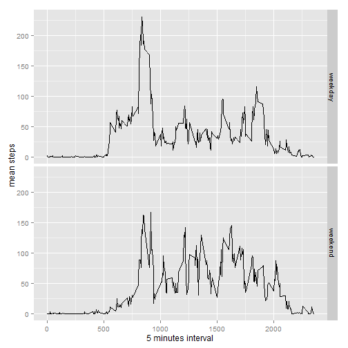

# Analysis to Personal Movement using Activity Moniroting Devices

## Loading and preprocessing the data


```r
setwd("C:/Users/bchoi/Documents/r-test/repdata_data_activity/")
data<-read.csv("activity.csv")
summary(data)
```

```
##      steps                date          interval     
##  Min.   :  0.00   2012-10-01:  288   Min.   :   0.0  
##  1st Qu.:  0.00   2012-10-02:  288   1st Qu.: 588.8  
##  Median :  0.00   2012-10-03:  288   Median :1177.5  
##  Mean   : 37.38   2012-10-04:  288   Mean   :1177.5  
##  3rd Qu.: 12.00   2012-10-05:  288   3rd Qu.:1766.2  
##  Max.   :806.00   2012-10-06:  288   Max.   :2355.0  
##  NA's   :2304     (Other)   :15840
```

## What is mean total number of steps taken per day? 


```r
sumdata<-aggregate(data$steps, by=list(category=data$date), FUN=sum, na.rm=TRUE)
colnames(sumdata)<-c("date", "sum")
hist(sumdata$sum, main="Histogram of Sum of Steps per Day", xlab="Sum of steps")
```

 

## What is the average daily activity pattern?


```r
meandata<-aggregate(data$steps, by=list(category=data$interval), FUN=mean, na.rm=TRUE)
colnames(meandata)<-c("interval", "mean")
plot(meandata$mean ~ meandata$interval, type="l", main="Mean of steps in each 5 minutes interval accross days", xlab="minutes on a day", ylab="mean of steps")
```

 

```r
sortedmean<-meandata[order(meandata$mean, decreasing=TRUE), ]
head(sortedmean, n=1)
```

```
##     interval     mean
## 104      835 206.1698
```
## Imputing missing values


```r
sum(is.na(data$interval))
```

```
## [1] 0
```

```r
data2<-data
for (i in 1:nrow(data2))
        if (is.na(data2[i,]$steps))
                data2[i,]$steps<-meandata[meandata$interval==data2[i,]$interval,]$mean
sumdata2<-aggregate(data2$steps, by=list(category=data2$date), FUN=sum, na.rm=TRUE)
colnames(sumdata2)<-c("date", "sum")
hist(sumdata2$sum, main="Histogram of Sum of Steps per Day with filling NA", xlab="Sum of steps")
```

 
With NA

```r
mean(sumdata2$sum)
```

```
## [1] 10766.19
```

```r
median(sumdata2$sum)
```

```
## [1] 10766.19
```

After filling NA with average of same 5 min interval of the day

```r
median(sumdata$sum)
```

```
## [1] 10395
```

```r
mean(sumdata$sum)
```

```
## [1] 9354.23
```
# Are there differences in activity patterns between weekdays and weekends? 

```r
data3<-data2
data3$date<-as.Date(as.character(data3$date), format="%Y-%m-%d")
data3$days<-as.factor(ifelse(weekdays(as.Date(data3$date, format="%y-%m-%d")) %in% c("Saturday", "Sunday"), "weekend", "weekday"))
library(ggplot2)
meandata3<-aggregate(data3$steps, by=list(category=data3$interval, data3$days), FUN=mean)
colnames(meandata3)<-c("interval", "days", "mean")
sp<-ggplot(data=meandata3, aes(x=interval, y=mean)) + geom_line() + xlab("5 minutes interval") + ylab("mean steps")
sp + facet_grid(days ~ ., as.table=TRUE)
```

 

